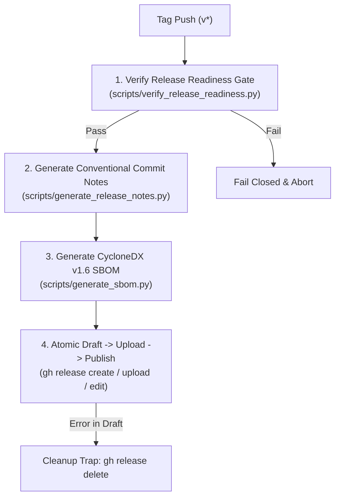

# GaiaOS Automated Release Publishing Guide

## 1. Overview & Architecture

GaiaOS automates GitHub Release publishing via a CI-driven pipeline defined in [`.github/workflows/release.yml`](../../.github/workflows/release.yml).

When a maintainer pushes a git version tag matching `v*` (e.g. `v1.0.0`), GitHub Actions triggers the automated release pipeline to validate release readiness, generate structured release notes from conventional commits, build a CycloneDX v1.6 Software Bill of Materials (SBOM), and atomically publish the GitHub Release.

---

## 2. Release Pipeline Pipeline Steps

The automated release workflow executes 4 distinct stages:



### Stage 1: Release Readiness Gate (`scripts/verify_release_readiness.py`)
- Enforces semantic versioning tag format (`vX.Y.Z` or `vX.Y.Z-rcW`).
- Verifies that [`docs/releases/Versioning.md`](../releases/Versioning.md) contains an explicit entry describing the tag being published.
- **Fail-Closed Gate**: If the documentation is stale or missing the tag entry, the workflow fails immediately before any draft release is created.

### Stage 2: Conventional Commit Release Notes Generator (`scripts/generate_release_notes.py`)
- Extracts commit logs since the previous git tag.
- Parses conventional commit prefixes (`feat:`, `fix:`, `docs:`, `refactor:`, `perf:`, `ci:`, `BREAKING CHANGE:`) and formats categorized markdown sections.

### Stage 3: CycloneDX v1.6 SBOM Generation (`scripts/generate_sbom.py`)
- Parses locked dependencies in `requirements/base.lock`.
- Formats a deterministic, compliant CycloneDX v1.6 JSON specification (`gaiaos-sbom.json`).

### Stage 4: Atomic Draft-Then-Publish Flow (`.github/workflows/release.yml`)
- **Draft Creation**: Initializes the release as `--draft` (`gh release create`).
- **Artifact Attachment**: Attaches `gaiaos-sbom.json` (`gh release upload`).
- **Publishing**: Converts the draft to a live public release (`gh release edit --draft=false`).
- **Rollback Protection**: An `EXIT` shell trap monitors `DRAFT_CREATED` and `RELEASE_PUBLISHED` flags. If an error occurs after draft creation but prior to publication, the trap automatically deletes the orphaned draft (`gh release delete "$TAG" --yes`).

---

## 3. Conventional Commit Standards

Release notes categories map to standard conventional commit prefixes:

| Commit Prefix | Category in Release Notes |
| :--- | :--- |
| `BREAKING CHANGE:` or `feat!:` / `fix!:` | **Breaking Changes** |
| `feat:` | **New Features & Capabilities** |
| `fix:` | **Bug Fixes & Corrections** |
| `docs:` | **Documentation** |
| `refactor:` / `perf:` | **Performance & Refactoring** |
| `ci:` / `build:` / `ops:` / `infra:` / `chore:` | **Build, CI & Infrastructure** |

---

## 4. Maintainer Release Workflow

Maintainers follow a deliberate 3-step human release procedure:

1. **Update Release History**:
   Add tag details and changelog summary to [`docs/releases/Versioning.md`](../releases/Versioning.md).

2. **Run Local Verification**:
   ```bash
   python scripts/verify_release_readiness.py --tag $(git describe --tags --abbrev=0)
   pytest tests/test_release_automation.py -v
   ```

3. **Tag & Push**:
   ```bash
   git tag v1.0.0
   git push origin v1.0.0
   ```

The automated GitHub Actions workflow completes release notes generation, SBOM building, and GitHub Release publication automatically.

